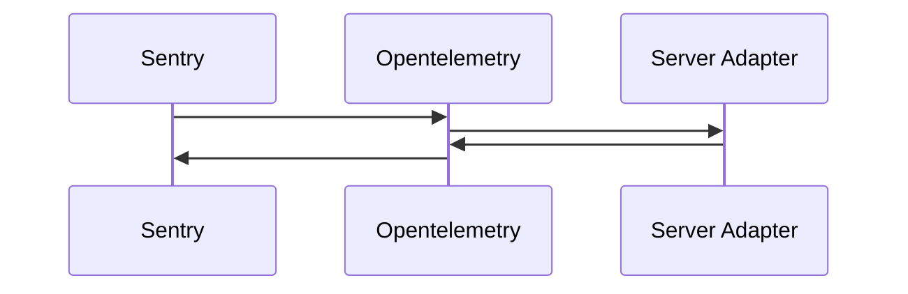
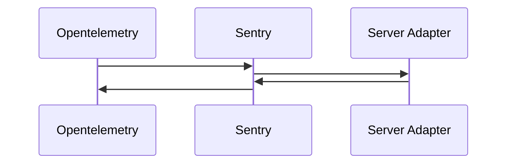

Add new Instruments API

Introduction of a new API allowing to instrument the graphql pipeline.

This new API differs from already existing Hooks by not having access to input/output of phases. The
goal of `Instruments` is to run allow running code before, after or around the **whole process of a
phase**, including plugins hooks executions.

The main use case of this new API is observability (monitoring, tracing, etc...).

### Basic usage

```ts
import { createYoga } from 'graphql-yoga'
import Sentry from '@sentry/node'
import schema from './schema'

const server = createYoga({
  schema,
  plugins: [
    {
      instruments: {
        request: ({ request }, wrapped) =>
          Sentry.startSpan({ name: 'Graphql Operation' }, async () => {
            try {
              await wrapped()
            } catch (err) {
              Sentry.captureException(err)
            }
          })
      }
    }
  ]
})
```

### Multiple instruments plugins

It is possible to have multiple instruments plugins (Prometheus and Sentry for example), they will
be automatically composed by envelop in the same order than the plugin array (first is outermost,
last is inner most).

```ts
import { createYoga } from 'graphql-yoga'
import schema from './schema'

const server = createYoga({
  schema,
  plugins: [useSentry(), useOpentelemetry()]
})
```



### Custom instruments ordering

If the default composition ordering doesn't suite your need, you can manually compose instruments.
This allows to have a different execution order of hooks and instruments.

```ts
import { composeInstruments, createYoga } from 'graphql-yoga'
import schema from './schema'

const { instruments: sentryInstruments, ...sentryPlugin } = useSentry()
const { instruments: otelInstruments, ...otelPlugin } = useOpentelemetry()
const instruments = composeInstruments([otelInstruments, sentryInstruments])

const server = createYoga({
  schema,
  plugins: [{ instruments }, useSentry(), useOpentelemetry()]
})
```


