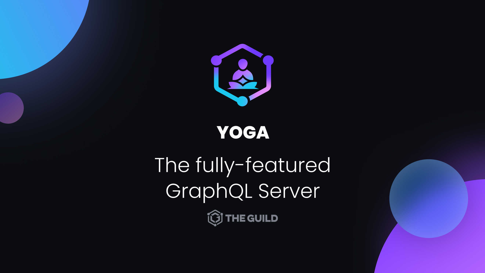

<p align="center"></p>

# GraphQL Yoga

Fully-featured GraphQL Server with focus on easy setup, performance & great developer experience

[Docs](https://www.graphql-yoga.com/docs)

### Installation

```shell
npm i @graphql-yoga/node graphql
```

### Quickstart

You will need to provide schema to Yoga, either by an existing executable schema, or by providing your type definitions and resolver map:

```ts
import { createServer } from '@graphql-yoga/node'

const server = createServer({
  schema: {
    typeDefs: /* GraphQL */ `
      type Query {
        hello: String
      }
    `,
    resolvers: {
      Query: {
        hello: () => 'Hello from Yoga!',
      },
    },
  },
})

server.start()
```

## Overview

- **Easiest way to run a GraphQL server:** Sensible defaults & includes everything you need with minimal setup (we also export a platform/env-agnostic handler so you can build your own wrappers easily).
- **Includes Subscriptions:** Built-in support for GraphQL subscriptions using [**S**erver-**S**ent **E**vents](https://developer.mozilla.org/en-US/docs/Web/API/Server-sent_events/Using_server-sent_events).
- **Compatible:** Works with all GraphQL clients ([Apollo](https://www.apollographql.com/docs/react/), [Relay](https://relay.dev/), [Urql](https://formidable.com/open-source/urql/)...) and fits seamless in your GraphQL workflow.
- **WHATWG Fetch API:** the core package depends on [WHATWG Fetch API](https://fetch.spec.whatwg.org/) so it can run and deploy on any environment (Serverless, Workers, Deno, Node).
- **Easily Extendable:** New GraphQL-Yoga support all [`envelop`](https://www.envelop.dev) plugins.

## Features

- [GraphQL over HTTP spec compliant](https://github.com/graphql/graphql-over-http)
- TypeScript
- File upload with [GraphQL Multipart Request spec](https://github.com/jaydenseric/graphql-multipart-request-spec)
- Realtime capabilities
- Accepts `application/json`, `application/graphql+json`, `application/x-www-form-urlencoded`, `application/graphql` and `multipart/formdata` content-types
- Supports [ESM](https://developer.mozilla.org/en-US/docs/Web/JavaScript/Guide/Modules)
- Runs everywhere: Can be deployed via `now`, `up`, AWS Lambda, Heroku etc.

### Contributing

If this is your first time contributing to this project, please do read our [Contributor Workflow Guide](https://github.com/the-guild-org/Stack/blob/master/CONTRIBUTING.md) before you get started off.

Feel free to open issues and pull requests. We're always welcome support from the community.

### Code of Conduct

Help us keep Yoga open and inclusive. Please read and follow our [
of Conduct](https://github.com/the-guild-org/Stack/blob/master/CODE_OF_CONDUCT.md) as adopted from [Contributor Covenant](https://www.contributor-covenant.org/)

### License

[](https://raw.githubusercontent.com/dotansimha/graphql-yoga/master/LICENSE)

MIT
