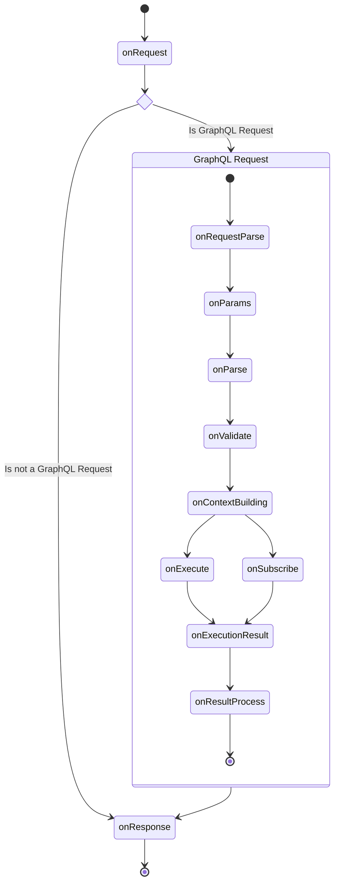

import { Callout } from '@theguild/components'

# Plugins

Yoga builds upon the GraphQL plugin system envelop and adds additional HTTP specific hooks for
customizing both the GraphQL execution and HTTP layer. Many of the additional features of Yoga are
added via plugins. If you need to customize your GraphQL API you can also write your own plugins.

## Using Plugins

You can both use Yoga or Envelop plugins with GraphQL Yoga.

<Callout>
  When there is both a Envelop and Yoga specific plugin available, you should always opt-in for the
  Yoga variant as this one allows certain optimizations compared to just an Envelop plugin. As
  envelop plugins have only control over the GraphQL execution for example a plugin such as the
  [response-cache](https://the-guild.dev/graphql/envelop/plugins/use-response-cache), can never act
  on the HTTP level. However, the [yoga response-cache](/docs/features/response-caching), [Persisted
  Operations](/docs/features/persisted-operations) or [Defer/Stream](/docs/features/defer-stream)
  plugin utilizes the HTTP level hooks, and thus can completly skip all of the expensive GraphQL
  execution steps for serving cached results.
</Callout>

### Yoga Plugin Example

Please refer to the corresponding feature documentation pages. E.g.
[Response Cache](/docs/features/response-caching),
[Persisted Operations](/docs/features/persisted-operations) or
[Defer/Stream](/docs/features/defer-stream).

```ts filename="Yoga Defer Stream Plugin Usage Example"
import { createServer } from 'node:http'
import { createYoga } from 'graphql-yoga'
import { useDeferStream } from '@graphql-yoga/plugin-defer-stream'

const yoga = createYoga({
  plugins: [useDeferStream()]
})

const server = createServer(yoga)

server.listen(4000, () => {
  console.info('Server is running on http://localhost:4000/graphql')
})
```

### Envelop Plugin Example

<Callout>
  [Envelop is a lightweight JavaScript (TypeScript) library for customizing the GraphQL execution
  layer, allowing developers to build, share and compose plugins that enhance the capabilities of
  your GraphQL server](https://envelop.dev). GraphQL Yoga uses [Envelop](https://envelop.dev) under
  the hood so you can easily extend your server's capabilities with the plugins from [Envelop
  Ecosystem](https://www.envelop.dev/plugins)
</Callout>

The following example adds [GraphQL JIT](https://github.com/zalando-incubator/graphql-jit) to our
GraphQL Server using [Envelop GraphQL JIT Plugin](https://www.envelop.dev/plugins/use-graphql-jit)

```ts
import { createSchema, createYoga } from 'graphql-yoga'
import { useGraphQlJit } from '@envelop/graphql-jit'

// Provide your schema
const yoga = createYoga({
  schema: createSchema({
    typeDefs: /* GraphQL */ `
      type Query {
        greetings: String!
      }
    `,
    resolvers: {
      Query: {
        greetings: () => 'Hello World!'
      }
    }
  }),
  plugins: [useGraphQlJit()]
})

// Start the server and explore http://localhost:4000/graphql
const server = createServer(yoga)
server.listen(4000, () => {
  console.info('Server is running on http://localhost:4000/graphql')
})
```

## Writing Plugins

Sometimes you might want to build your own plugins. You can write your own Yoga plugin and even
share it with other people by publishing it to `npm`.

<Callout>
  A good entry-point for discovering how to write Yoga plugins is to look at the source code of the
  existing plugins maintained by us.
</Callout>

The most hooks for Yoga origin from the envelop plugin system.
[Please refer to the Envelop Plugin Lifecycle documentation for more information.](https://the-guild.dev/graphql/envelop/docs/plugins/lifecycle)
In addition, Yoga adds more HTTP specific hooks.

### Plugin Lifecycle

The following diagram shows the plugin lifecycle of GraphQL Yoga. For a detailed description of each
hook, please refer to the detail sections of each hook.



### `onRequest`

This hook is invoked for ANY incoming HTTP request. Here you can manipulate the request or create a
short circuit before Yoga handles the request.

<Callout type="warning">

Exceptions thrown by this hook are not caught. This means they will buble up to the HTTP server
underlying implementation.

For example, the `node:http` server crashes the entire process on uncaught exceptions.

Prefer `onRequestParse` when possible, or wrap the hook code in a `try` block.

</Callout>

**Example actions in this hook:**

- Manipulate the request
- Short circuit before Yoga handles the request

#### API

- `request`: The incoming HTTP request as WHATWG `Request` object.
  [Learn more about the request](https://developer.mozilla.org/en-US/docs/Web/API/Request).
- `serverContext`: The early context object that is shared between all hooks and the GraphQL
  execution. [Learn more about the context](/docs/features/context).
- `fetchAPI`: WHATWG Fetch API implementation.
  [Learn more about the fetch API](https://developer.mozilla.org/en-US/docs/Web/API/Fetch_API).
- `url`: WHATWG URL object of the incoming request.
  [Learn more about the URL object](https://developer.mozilla.org/en-US/docs/Web/API/URL).
- `endResponse`: A function that allows you to end the request early and send a response to the
  client.

#### Example

```ts
import { Plugin } from 'graphql-yoga'

function useAuth(): Plugin {
  return {
    onRequest({ request, fetchAPI, endResponse }) {
      if (!request.headers.get('authorization')) {
        endResponse(
          new fetchAPI.Response(null, {
            status: 401,
            headers: {
              'Content-Type': 'application/json'
            }
          })
        )
      }
    }
  }
}
```

### `onRequestParse`

This hook is invoked for any incoming GraphQL HTTP request and is invoked before attempting to parse
the GraphQL parameters. Here you can manipulate the request, set a custom request parser or apply
security measures such as checking for access tokens etc.

**Example actions in this hook:**

- Manipulate the request
- Set custom GraphQL request parser (use custom GraphQL protocol)
- Apply security measures

### `onParams`

This hook is invoked for an incoming GraphQL request after the GraphQL parameters (`query`,
`variables`, `extensions` and `operationName`) have been ATTEMPTED to be parsed.

Within this hook you can manipulate and customize the parameters or even implement a whole new way
of parsing the parameters (if you wish to diverge from the GraphQL over HTTP specification).

In addition to that you could also short-circuit and skip the GraphQL execution. E.g. you might want
to serve a result from the cache instead.

**Example actions in this hook:**

- **[Response Cache](/docs/features/response-caching)**: Short-circuit GraphQL execution if response
  can be served from the cache.
- **[Persisted Operations](/docs/features/persisted-operations):** Load the `query` document string
  from the persisted operations store before running the execution.
- **[APQ](/docs/features/automatic-persisted-queries):** Load/persist the `query` document string on
  the persisted operations store.

### `onParse`

Called for parsing the GraphQL document. This hook has a before and after stage. You can hook into
before the document is parsed and/or into after the document is parsed.

**Example actions in this hook:**

- Replace GraphQL parser and support future GraphQL syntax
- Collect metrics about parsing success/failures

### `onValidate`

Called for validating the GraphQL document. This hook has a before and after stage. You can hook
into before the document is parsed and/or into after the document is parsed.

**Example actions in this hook:**

- Register additional validation rules (e.g. [Disable Introspection](/docs/features/introspection))
- Collect metrics about validation success/failures

### `onContextBuilding`

Called for building the GraphQL context. This hook has a before and after stage. You can hook into
before and after the context is built.

**Example actions in this hook:**

- Authentication
- Add data to context object (e.g. user data or dataloader instances)

### `onExecute`

Called for executing a GraphQL mutation or query operation. This hook has a before and after stage.
You can hook into before and after the GraphQL request is executed.

**Example actions in this hook:**

- Collect metrics about execution time
- Error logging/reporting

### `onSubscribe`

Called for subscribing to a GraphQL subscription operation. This hook has a before and after stage.
You can hook into before and after the GraphQL subscription is executed.

**Example actions in this hook:**

- Collect metrics about execution time
- Error logging/reporting

### `onExecutionResult`

This hook is invoked for each result produced for GraphQL operation, before it is processed to be
sent to client.

In particular, it is useful to handle batched operations. If a request contains batched operations,
this hook is called once of each operation, while `onResultProcess` will be only called once for the
entire request.

Here, you can modify the result, to add monitoring or instrumentation extensions for example.

**Example actions in this hook:**

- Add metadata to results
- Collect errors

### `onResultProcess`

This hook is invoked after a GraphQL request has been processed and before the response is forwarded
to the client. Here you can customize what transport/response processor format should be used for
sending the result over the wire.

**Example actions in this hook:**

- Specify custom response format
- Logging/Metrics

### `onResponse`

This hook is invoked after a HTTP request (both GraphQL and NON GraphQL) has been processed and
after the response has been forwarded to the client. Here you can perform any cleanup or logging
operations, or you can manipulate the outgoing response object.

<Callout type="warning">

Exceptions thrown by this hook are not caught. This means they will buble up to the HTTP server
underlying implementation.

For example, the `node:http` server crashes the entire process on uncaught exceptions.

Prefer `onRequestParse` when possible, or wrap the hook code in a `try` block.

</Callout>

**Example actions in this hook:**

- Specify custom response format
- Logging/Metrics

#### API

- `request`: The incoming HTTP request as WHATWG `Request` object.
  [Learn more about the request](https://developer.mozilla.org/en-US/docs/Web/API/Request).
- `serverContext`: The final context object that is shared between all hooks and the GraphQL
  execution. [Learn more about the context](/docs/features/context).
- `response`: The outgoing HTTP response as WHATWG `Response` object.
  [Learn more about the response interface](https://developer.mozilla.org/en-US/docs/Web/API/Response).

#### Example

```ts
import { Plugin } from 'graphql-yoga'

function useYogaSignature(): Plugin {
  return {
    onResponse({ request, response }) {
      response.headers.set('X-GraphQL-Server', 'Yoga')
    }
  }
}
```
