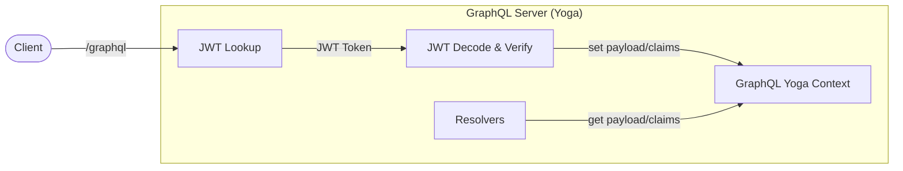

import { Callout } from '@theguild/components'

# JWT

A [JSON Web Tokens (JWT)](https://jwt.io/) is a signed token containing arbitrary informations,
commonly used for authentication. By being signed by the issuer of the token, it can be verified
that the token is valid and has not been tampered with.

The `@graphql-yoga/plugin-jwt` can be used with GraphQL Yoga for multiple types of authentication
flows (either as a Subgraph implementation, or Gateway implementation).

GraphQL Yoga provides a plugin to easily integrate JWT into your API.

## Installation

```sh npm2yarn
npm i @graphql-yoga/plugin-jwt
```

## Usage

> ℹ️ If you are using [Hive Gateway](https://the-guild.dev/graphql/hive), you use a higher-level
> plugin to handle the JWT token, and automatically pass the token's payload to the subgraphs.
> Please refer to
> [JWT plugin in Hive Gateway documentation](https://the-guild.dev/graphql/hive/docs/gateway/authorization-authentication#using-the-jwt-token).

This plugin is responsible for validating the JWT, injecting token's payload into the GraphQL
context.



For the setup mentioned above, you can use the following configuration for your Yoga server:

```ts filename="server.ts"
import { createYoga } from 'graphql-yoga'
import jwt from 'jsonwebtoken'
import {
  createInlineSigningKeyProvider,
  createRemoteJwksSigningKeyProvider,
  extractFromHeader,
  useJWT
} from '@graphql-yoga/plugin-jwt'
import { getUserById, getUserByLogin } from './db'

const signingKey = process.env.JWT_SECRET

const yoga = createYoga({
  schema: mySchema, // Provide your GraphQL schema
  plugins: [
    useJWT({
      // Configure your signing providers: either a local signing-key or a remote JWKS are supported.
      signingKeyProviders: [
        createInlineSigningKeyProvider(signingKey),
        createRemoteJwksSigningKeyProvider({ jwksUri: 'https://example.com/.well-known/jwks.json' })
      ],
      // Configure where to look for the JWT token: in the headers, or cookies.
      // By default, the plugin will look for the token in the 'authorization' header only.
      tokenLookupLocations: [extractFromHeader({ name: 'authorization', prefix: 'Bearer' })],
      // Configure your token issuers/audience/algorithms verification options.
      // By default, the plugin will only verify the HS256/RS256 algorithms.
      // Please note that this should match the JWT signer issuer/audience/algorithms.
      tokenVerification: {
        issuer: 'http://my-issuer.com',
        audience: 'my-audience',
        algorithms: ['HS256', 'RS256']
      },
      // Configure context injection after the token is verified.
      // By default, the plugin will inject the token's payload into the context into the `jwt` field.
      // You can pass a string: `"myJwt"` to change the field name.
      extendContext: true,
      // The plugin can reject the request if the token is missing or invalid (doesn't pass JWT `verify` flow).
      // By default, the plugin will reject the request if the token is missing or invalid.
      reject: {
        missingToken: true,
        invalidToken: true
      }
    })
  ]
})

const server = createServer(yoga)
server.listen(4000, () => {
  console.log(`Server is running on http://localhost:4000/${server.graphqlEndpoint}`)
})
```

Now, in your GraphQL resolvers, you'll have access to the `context.jwt` field, which contains the
verified JWT payload/claims.

```ts filename="resolvers.ts"
const resolvers = {
  Query: {
    viewer: (parent, args, ctx) => {
      if (!ctx.jwt) {
        return throw new GraphQLError('Unauthorized')
      }

      // ctx.jwt contains an object with `payload`, `token.value` + `token.prefix`
      return {
        id: ctx.jwt.payload.sub,
        name: ctx.jwt.payload.profile.username
      }
    }
  }
}
```

## Additional Configuration

### Token lookup

The plugin can be configured to look for the JWT token in different locations:

#### HTTP Header

By default, the plugin will look for the token in the `authorization` header. You can configure the
plugin to look for the token in a different header or with a different prefix.

The prefix is being validated along with the token (for example: `Bearer my-token`).

```ts
imoprt { extractFromHeader, useJWT } from '@graphql-yoga/plugin-jwt'

const yoga = createYoga({
  // ...
  plugins: [
    useJWT({
      lookupLocations: [
        extractFromHeader({ name: 'x-auth-token', prefix: 'Bearer' }),
      ]
    })
  ]
})
```

#### HTTP Cookie

You can configure the plugin to look for the token in a cookie. To do so, you'll need to add the
`@whatwg-node/server-plugin-cookies` package and add `useCookies` plugin to your Yoga plugins:

```ts
import { useCookies } from '@whatwg-node/server-plugin-cookies'
imoprt { extractFromCookie, useJWT } from '@graphql-yoga/plugin-jwt'

const yoga = createYoga({
  // ...
  plugins: [
    // Make sure to add the useCookies plugin before the useJWT plugin.
    useCookies(),
    useJWT({
      lookupLocations: [extractFromCookie({ name: 'my-cookie' })]
    })
  ]
})
```

#### WebSockets Connection Params

You can configure the plugin to look for the token in the connection params of a WebSocket
connection if you use `graphql-ws` as
[here](https://the-guild.dev/graphql/yoga-server/docs/features/subscriptions#graphql-over-websocket-protocol-via-graphql-ws).

```ts
import { extractFromConnectionParams, useJWT } from '@graphql-yoga/plugin-jwt'

const yoga = createYoga({
  // ...
  plugins: [
    useJWT({
      // So it will look for the token in the connectionParams.token field in case of a WebSockets connection
      lookupLocations: [extractFromConnectionParams({ name: 'token' })]
    })
  ]
})
```

##### Client-side example

After setting up JWT Plugin and Yoga server with WebSocket support, you can pass `token` from the
client like below with `graphql-ws` client.

```ts
import { createClient } from 'graphql-ws'
import { getCurrentToken } from './my-auth'

const client = createClient({
  url: 'ws://localhost:4000/graphql',
  // The object returned by this function will be passed to the server as `connectionParams` to be used by the JWT plugin
  connectionParams: async () => {
    return {
      // the token is fetched from the storage
      token: await getCurrentToken()
    }
  }
})
```

#### Custom Function

You can configure the plugin to use a custom function to look for the token:

```ts
const getToken = ({ request, serverContext, url }) => {
  return request.headers.get('x-my-token')
}

const yoga = createYoga({
  // ...
  plugins: [
    useJWT({
      lookupLocations: [getToken]
    })
  ]
})
```

#### Multiple locations

You can configure the plugin to look for the token in multiple locations. The plugin will look for
the token in the order you provide.

```ts
imoprt { extractFromHeader, extractFromCookie, useJWT } from '@graphql-yoga/plugin-jwt'

const yoga = createYoga({
  // ...
  plugins: [
    useCookies(),
    useJWT({
      lookupLocations: [
        extractFromHeader({ name: 'authorization', prefix: 'Bearer' }),
        extractFromHeader({ name: 'x-legacy-auth' }),
        extractFromHeader({ name: 'x-api-key', prefix: 'API-Access' }),
        extractFromCookie({ name: 'browserAuth' })
      ]
    })
  ]
})
```

---

### Signing Key providers

The plugin can be configured to use different signing key providers:

#### Inline

You can provide the signing key directly in the configuration.

> Do not hardcode the signing key in your code. Use environment variables, local encrypted file or a
> secret store!

```ts
import { createInlineSigningKeyProvider, useJWT } from '@graphql-yoga/plugin-jwt'

const yoga = createYoga({
  // ...
  plugins: [
    useJWT({
      signingKeyProviders: [createInlineSigningKeyProvider(process.env.MY_JWT_SECRET)]
    })
  ]
})
```

> In case you are using an inline signing key provider, all `keyid` / `kid` will be allowed in
> tokens.

#### Remote JWKS

You can configure the plugin to fetch the signing key from a remote JWKS endpoint.

Provide a `jwksClientOptions` object (see
[node-jwks-rsa documentation](https://github.com/auth0/node-jwks-rsa/blob/master/EXAMPLES.md)].

```ts
import { createRemoteJwksSigningKeyProvider, useJWT } from '@graphql-yoga/plugin-jwt'

const yoga = createYoga({
  // ...
  plugins: [
    useJWT({
      signingKeyProviders: [
        createRemoteJwksSigningKeyProvider({
          jwksUri: 'https://example.com/.well-known/jwks.json'
        })
      ]
    })
  ]
})
```

#### Multiple providers

When using multiple providers, the plugin will try to use the first available signing key.

```ts
import {
  createInlineSigningKeyProvider,
  createRemoteJwksSigningKeyProvider,
  useJWT
} from '@graphql-yoga/plugin-jwt'

const yoga = createYoga({
  // ...
  plugins: [
    useJWT({
      signingKeyProviders: [
        // In case your remote provider is not available, the plugin will try use the inline provider.
        createRemoteJwksSigningKeyProvider({
          jwksUri: 'https://example.com/.well-known/jwks.json'
        }),
        createInlineSigningKeyProvider(process.env.MY_JWT_SECRET)
      ]
    })
  ]
})
```

---

### Token Verification

The plugin verification process can be customized to match the JWT token `issuer`, `audience`, and
algorithms.

> Note that the verification options should match the JWT signer's configuration.

You can find
[here the complete list of verification options](https://github.com/DefinitelyTyped/DefinitelyTyped/blob/master/types/jsonwebtoken/index.d.ts#L58-L77)
for this plugin.

```ts
const yoga = createYoga({
  // ...
  plugins: [
    useJWT({
      tokenVerification: {
        issuer: ['http://yoga'],
        audience: 'my-audience',
        algorithms: ['HS256', 'RS256']
      }
    })
  ]
})
```

### Execution Rejection

The plugin can be configured to reject the request if the token is missing or invalid.

By default, an authentication error will be thrown if the token is missing or invalid, and the
request will be reject with status code `401`.

```ts
const yoga = createYoga({
  // ...
  plugins: [
    useJWT({
      reject: {
        missingToken: true,
        invalidToken: true
      }
    })
  ]
})
```

> In case you want to handle the error yourself, you can set
> `reject: { missingToken: false, invalidToken: false }` and handle the error in your resolvers. The
> `context.jwt` will be `undefined` in case of missing or invalid token.

### Context Injection

By default, the plugin will inject the token's payload into the context into the `jwt` field.

You can change the field name by passing an object (for example: `{ fieldName: "myJwt" }`), or to
disable this behavior by passing `false`.

```ts
const yoga = createYoga({
  // ...
  plugins: [
    useJWT({
      extendContext: { fieldName: 'myJwt' }
    })
  ]
})
```

### Disable Introspection based on JWT

If you disabled rejection on missing token and/or invalid token, you can disable introspection based
on the validity of JWT token still. You can combine JWT plugin with
[Disable Introspection plugin](/docs/features/introspection#disabling-introspection) in this case.

```sh npm2yarn
npm i @graphql-yoga/plugin-disable-introspection
```

Then you can use it like this:

```ts
import { useDisableIntrospection } from '@graphql-yoga/plugin-disable-introspection'
import { useJWT } from '@graphql-yoga/plugin-jwt'

const yoga = createYoga({
  // ...
  plugins: [
    useJWT({
      reject: {
        missingToken: false,
        invalidToken: false
      }
    }),
    useDisableIntrospection({
      disableIf(_req, ctx) {
        // If there is no JWT token(unauthorized), disable introspection
        if (!ctx.jwt) {
          return true
        }
        return false
      }
    })
  ]
})
```
